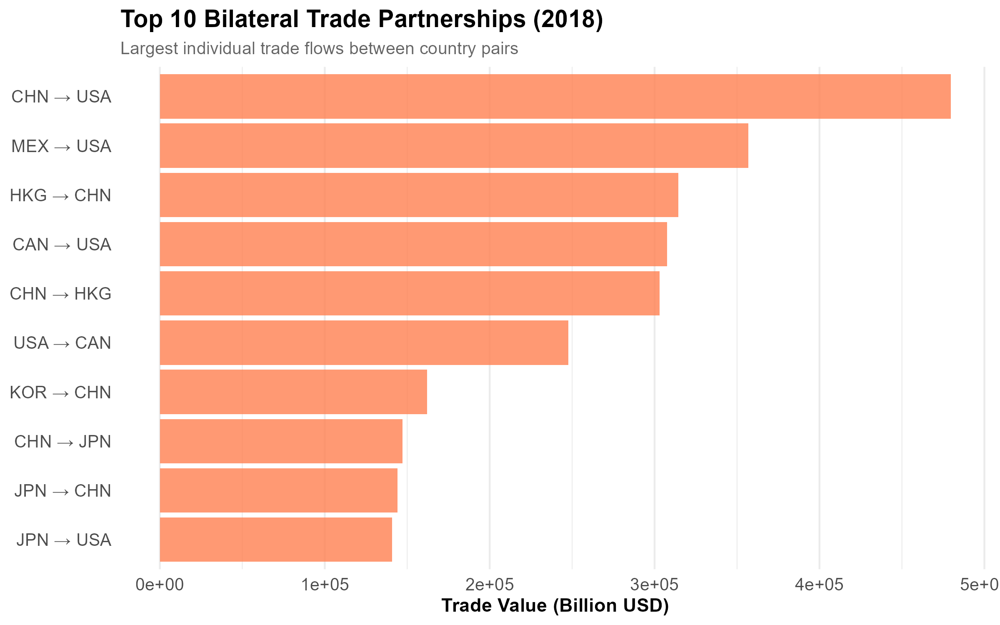
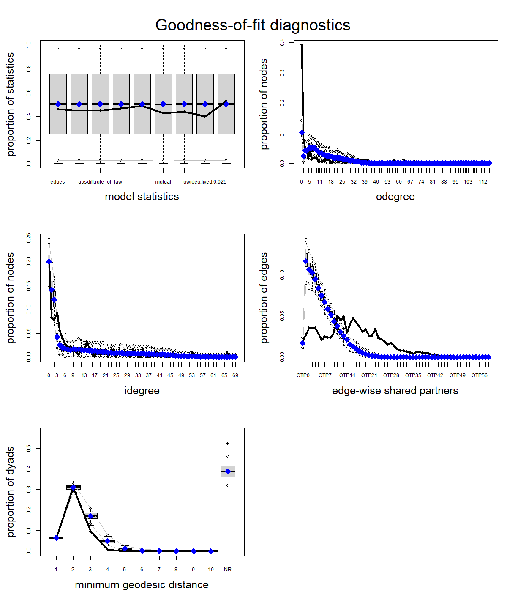

```{r}
#| label: load-mrqap-models
#| include: false

mod0        <- readRDS("models/mod0.rds")
mod1        <- readRDS("models/mod1.rds")
mod_H1a     <- readRDS("models/mod_H1a.rds")
mod_H1a_H2a <- readRDS("models/mod_H1a_H2a.rds")
```

```{r}
#| label: analysis-preferences
#| include: false

# Seed for random number generation
set.seed(42)
knitr::opts_chunk$set(cache.extra = knitr::rand_seed)
```



## Glossary {.unnumbered}

::: {#sec-gloss}
\setlength{\arrayrulewidth}{0.05pt}
\begin{longtable}{p{0.28\textwidth} p{0.68\textwidth}}
\caption{Definitions of Key Terms}
\label{tab:key-terms-wgi} \\
\hline
\textbf{Term} & \textbf{Definition} \\
\hline
\endfirsthead

\hline
\textbf{Term} & \textbf{Definition} \\
\hline
\endhead

\hline
\endfoot

\hline
\endlastfoot

Bilateral Trade 
&
Trade between two specific countries, measured as exports from one to the other and vice versa. \\
\hline

Export value 
&
The total monetary value of goods and services sold by one country to another, measured in U.S. dollars. \\
\hline

Macroeconomic Stability 
&
The condition in which a country experiences low inflation, steady growth, and minimal fiscal or external imbalances. \\
\hline

Institutional Similarity 
&
The degree to which countries share similar governance qualities, such as rule of law, corruption control, and regulatory quality. \\
\hline

Worldwide Governance Indicators (WGI) 
&
Quantitative measures developed by the World Bank to assess broad patterns in perceptions of the quality of governance across countries and over time. The WGI reports governance indicators for over 200 countries and territories for six dimensions of governance: Voice and Accountability; Political Stability and Absence of Violence/Terrorism; Government Effectiveness; Regulatory Quality; Rule of Law; Control of Corruption. \\
\hline

Government Effectiveness: Estimate 
&
Government Effectiveness captures perceptions of the quality of public services, the quality of the civil service and the degree of its independence from political pressures, the quality of policy formulation and implementation, and the credibility of the government's commitment to such policies. Estimate gives the country's score on the aggregate indicator, in units of a standard normal distribution, i.e. ranging from approximately -2.5 to 2.5. \\
\hline

Regulatory Quality: Estimate 
&
Regulatory Quality captures perceptions of the ability of the government to formulate and implement sound policies and regulations that permit and promote private sector development. Estimate gives the country's score on the aggregate indicator, in units of a standard normal distribution, i.e. ranging from approximately -2.5 to 2.5. \\
\hline

Rule of Law: Estimate 
&
Rule of Law captures perceptions of the extent to which agents have confidence in and abide by the rules of society, and in particular the quality of contract enforcement, property rights, the police, and the courts, as well as the likelihood of crime and violence. Estimate gives the country's score on the aggregate indicator, in units of a standard normal distribution, i.e. ranging from approximately -2.5 to 2.5. \\
\hline

Control of Corruption: Estimate 
&
Control of Corruption captures perceptions of the extent to which public power is exercised for private gain, including both petty and grand forms of corruption, as well as "capture" of the state by elites and private interests. Estimate gives the country's score on the aggregate indicator, in units of a standard normal distribution, i.e. ranging from approximately -2.5 to 2.5. \\
\hline

\end{longtable}
:::

## Abstract

This study investigates whether similarities in governance characteristics influence
bilateral trade relationships and how governance interacts with structural dependencies in
the global trade network. Using international export data for 181 countries in 2018, two
research questions are addressed: whether governance similarity affects bilateral trade
intensity, and how governance similarity and endogenous network structures jointly shape
global export relationships. The analysis combines Multiple Regression Quadratic
Assignment Procedure (MRQAP) models with Exponential Random Graph Models (ERGMs), enabling
the joint assessment of dyadic attributes and network interdependencies. The MRQAP results
indicate that bilateral trade intensity is primarily driven by economic fundamentals,
particularly market size, while similarities in regulatory quality and corruption control
do not exhibit statistically significant effects once economic factors are controlled for.
In contrast, the ERGM analysis demonstrates that network structure plays a central role in
shaping strong trade ties. Reciprocity, clustering, and hub dominance strongly
characterize the global trade network, with countries that import large volumes acting as
key attractors. Governance similarity shows only a modest association with the presence of
strong trade ties and is small relative to structural and economic drivers. Overall, the
findings suggest that global trade patterns in 2018 were shaped more by economic scale and
self-reinforcing network dynamics than by institutional alignment.

## Introduction

### Common Ground: The Relationship Between Governance and Trade

The global trade network is a core foundation of the modern economy, enabling countries to
exchange goods, services, and capital in ways that drive productivity and long-term
growth. International trade is shaped not only by economic fundamentals but also by the
governance environments in which countries operate. Understanding how governance
similarity shapes bilateral trade is essential, as institutional alignment can enhance
regulatory predictability and foster trust, thereby amplifying trade volumes and
strengthening economic integration. This research specifically investigates how governance
similarity between nations influences the strength of their bilateral trade relations.

Empirical studies consistently demonstrate that governance conditions affect bilateral
trade costs and export performance. Evidence from [@de_groot_institutional_2004] shows
that countries with similar institutional frameworks trade approximately 13% more with
each other, while improvements in overall institutional quality can increase bilateral
trade volumes by 30–44%. Research from [@sabry_arab-german_2022], examining Arab exports
to Germany, similarly finds that regulatory quality and government effectiveness drive
export performance, although the magnitude of these effects varies across regions and
industries, such as textiles. Likewise, [@landry_does_2024] reports that improvements in
corruption control and democratic governance increase African exports to Western partners,
but do not produce the same effect in trade with China.

Further evidence reinforces these governance effects.
[@university_of_economic_studies_bucharest_romania_governance_2021] using an augmented
gravity model for Romanian–EU trade, finds that regulatory quality has the strongest
positive impact on exports, while weak institutional performance limits deeper trade
integration. [@didier_characterising_2021] documents asymmetric governance effects in
Sub-Saharan African trade with China: stronger governance enhances Chinese exports to
Africa, whereas weaker governance, particularly higher corruption, can facilitate African
exports to China.

Despite this evidence, most studies rely on gravity models that assume independence across
trade pairs and overlook interdependencies in the global trade network, such as
reciprocity, clustering, and transitivity. To address this, recent research has adopted
Exponential Random Graph Models (ERGMs), which explicitly account for relational
dependencies and allow structural, political, and economic factors to be assessed
simultaneously [@noauthor_inferential_nodate; @schweitzer_economic_2009]. For example,
[@noauthor_analysis_nodate] applies ERGM to the global wheat trade and shows that
reciprocity, GDP, and geographic proximity shape tie formation, while
[@setayesh_analysis_2022] finds that GDP, distance, diplomatic exchanges, and landlocked
status influence trade relations, with transitivity adding explanatory power beyond dyadic
predictors.

However, existing ERGM applications often rely on backbone extraction methods such as the
disparity filter [@serrano_extracting_2009] to convert weighted networks to binary ones.
While this simplifies estimation, it discards important information on trade intensity,
limiting the detection of variation in export strength and obscuring key patterns of
economic interdependence, especially among closely integrated or institutionally aligned
countries. As [@setayesh_analysis_2022] note, studies should “observe the global trade
network as a weighted network without applying backbone methods” to capture both the
presence and magnitude of trade ties accurately.

### Concern

To address this gap, the present study employs GERGM, developed by
[@desmarais_statistical_2012], which extends ERGM methodology to networks with
continuous-valued edges. GERGM models endogenous network dependencies, including
reciprocity, transitivity, and clustering, while incorporating edge weights that represent
trade intensity. This approach enables a comprehensive representation of the global trade
system as both structurally interdependent and quantitatively differentiated, capturing
not only whether trade ties exist but also their relative economic significance.
Additionally, most prior research focuses on region- or sector-specific cases, limiting
global generalizability.

Therefore, the challenge is to develop a modeling approach that simultaneously:

-   Captures structural network dependencies, including reciprocity, transitivity, and
    clustering;
-   Preserves trade intensity information through weighted edges;
-   Incorporates country-level governance attributes;
-   Tests the role of institutional similarity in shaping trade patterns.

Based on these considerations, the present study addresses two main research questions.
First, it examines how countries’ governance characteristics influence the intensity of
their bilateral trade relationships. Second, it investigates how governance similarity,
along with network structural interdependencies, such as reciprocal exchange and clustered
trading patterns, shapes the overall configuration of global export ties, thereby
capturing the interdependent nature of the international trade network. For the purposes
of this study, the analysis focuses on four dimensions that are most directly relevant to
economic and institutional indicators of trade: Government Effectiveness, Regulatory
Quality, Rule of Law, and Control of Corruption, while excluding Voice and Accountability
and Political Stability and Absence of Violence/Terrorism, which fall outside the scope of
the research.

**Research Question 1:** How do similarities in governance characteristics between country
pairs influence the intensity of their bilateral trade relationships?

1.  **Hypotheses H1a:** Countries with more similar levels of regulatory quality engage in
    higher-value bilateral trade.

    When countries share comparable institutional frameworks, firms face lower
    coordination and enforcement costs through contract negotiation and dispute
    resolution, according to [@francois_institutions_2013; @dixit_lawlessness_2011],
    reducing transaction frictions and enabling greater private-sector participation in
    cross-border markets. Because regulatory quality reflects a government’s capacity to
    design and implement policies that support private-sector development, institutional
    similarity is expected not only to increase the likelihood of trade relationships
    emerging but also to enhance the intensity of existing trade flows. By lowering firms’
    adaptation costs when entering foreign markets, similar regulatory environments
    facilitate deeper export integration, forming the basis for **Hypothesis H1a**.

2.  **Hypothesis H1b:** Countries with more similar levels of corruption control engage in
    higher-value bilateral trade.

    As noted in the [@shleifer_corruption_1993], firms also face lower enforcement costs
    when corruption levels and rule-of-law standards are comparable, reducing uncertainty
    about contract enforcement and thereby improving trade potential, motivating
    **Hypothesis H1b**.

**Research Question 2:** How do similarities in governance quality and the broader
patterns of interdependence among trading partners influence the formation and intensity
of bilateral export relationships across countries in the global economy?

1.  **Hypotheses H2a:** Countries with more similar levels of regulatory quality are
    expected to engage in higher-value bilateral trade

2.  **Hypothesis H2b:** Countries with more similar rule‐of‐law conditions are expected to
    engage in higher-value bilateral trade.

    Likewise, similarity in the rule of law reduces legal uncertainty in cross-border
    transactions and mitigates the negative effects of weak contract enforcement on trade
    flows [@de_groot_institutional_2004; @noauthor_role_nodate]. When both trading
    partners have comparable legal systems, including strong contract enforcement and
    effective property rights protection, firms can confidently enter into long-term trade
    relationships and make relationship-specific investments, supporting **Hypothesis
    H2a** and **Hypothesis H2b**.

3.  **Hypothesis H2c:** Bilateral export relationships are expected to display
    reciprocity, such that higher export volumes from one country to its trading partner
    are associated with higher export volumes received in return from that partner.

    Trade networks are not random but exhibit systematic structural patterns driven by
    economic, political, and strategic considerations. One key structural feature of trade
    networks is reciprocity, which reflects the tendency for countries to return export
    flows received from their partners [@setayesh_analysis_2022]. Reciprocal trade emerges
    through several channels, including diplomatic norms, bilateral or regional trade
    agreements, and mutual economic interdependence, all of which encourage balanced
    exchange rather than one-sided trade flows. Research from [@noauthor_make_nodate]
    shows that mutual economic dependence creates incentives for countries to maintain
    stable, reciprocal trade relationships, as disruptions would harm both partners.
    Together, these studies provide the theoretical foundation for **Hypothesis H2c**.

4.  **Hypothesis H2d:** Trade relationships exhibit transitivity, where countries are more
    likely to trade intensively with partners of their existing trading partners,
    resulting in clustered patterns of export ties.

5.  **Hypothesis H2e:** Countries that already receive high levels of imports from many
    partners are likely to become attractive trade destinations, making others more likely
    to export to them.

    Clustering patterns are another important determinant of trade network structure,
    motivating **Hypothesis H2d**. Countries within regional trade blocs (e.g., EU, ASEAN,
    NAFTA) develop dense, interconnected trade relationships through harmonized
    regulations and reduced non-tariff barriers [@de_groot_institutional_2004;
    @noauthor_pdf_2025-1], which transitive closure is significant in service trade
    networks [@feng_service_2021]. These researches highlights the highly heterogeneous
    nature of trade connections and demonstrates that network degree and centrality
    patterns matter, as a small number of countries act as major hubs, holding a
    disproportionately large share of global trade flows. Consequently, the concentration
    of trade ties on large import markets supports **Hypothesis H2e**.

Understanding these structural patterns is essential because they reflect systemic forces
that operate beyond bilateral or single-country characteristics, shaping the overall
architecture of the global trade.

\setlength{\arrayrulewidth}{0.05pt}
\begin{longtable}{p{0.27\textwidth} p{0.29\textwidth} p{0.40\textwidth}}
\caption{Hypotheses, Model Terms, and Theoretical Motivation}
\label{tab:hypo_summary} \\
\hline
\textbf{Hypothesis} & \textbf{ERGM Term} & \textbf{Motivation} \\
\hline
\endfirsthead

\hline
\textbf{Hypothesis} & \textbf{ERGM Term} & \textbf{Motivation} \\
\hline
\endhead

\hline
\endfoot

\hline
\endlastfoot

\textbf{H2a: Regulatory Quality Similarity}  
Countries with more similar levels of regulatory quality are expected to engage in higher-value bilateral trade
&
\texttt{absdiff(regulatory\_quality)}
&
The \texttt{absdiff(regulatory\_quality)} term captures the tendency for countries with similar regulatory frameworks to form higher-value trade relationships. Similar regulatory standards reduce compliance costs and increase operational compatibility, facilitating valuable bilateral trade
\\
\hline

\textbf{H2b: Rule of Law Similarity}  
Countries with more similar rule‐of‐law conditions are expected to engage in higher-value bilateral trade
&
\texttt{absdiff(rule\_of\_law)}
&
The \texttt{absdiff(rule\_of\_law)} term captures how similar institutions reduce transaction costs through aligned contract enforcement, shared regulatory standards, and comparable property rights protections, facilitating high-value trade flows
\\
\hline

\textbf{H2c: Reciprocity}  
Bilateral export relationships are expected to display reciprocity, such that higher export volumes from one country to its trading partner are associated with higher export volumes received in return from that partner
&
\texttt{mutual}
&
The \texttt{mutual} term captures the tendency for bilateral trade relationships to exhibit reciprocity, whereby higher export flows from one country are associated with higher return flows from its trading partner. Reciprocal trade reflects balanced exchange and mutual commitment, reducing asymmetric dependence and fostering more stable and sustainable trading relationships.
\\
\hline

\textbf{H2d: Transitivity}  
Trade relationships exhibit transitivity, where countries are more likely to trade intensively with partners of their existing trading partners, resulting in clustered patterns of export ties
&
\texttt{dgwesp(decay = 0.25, fixed = TRUE, type="OTP")}
&
The \texttt{dgwesp(decay = 0.25, fixed = TRUE, type="OTP")} term captures the tendency for triadic closure in trade networks, in which countries sharing a common trading partner are more likely to trade intensively with each other. Shared partners reduce information asymmetries and search costs, facilitating clustered export patterns
\\
\hline

\textbf{H2e: Popularity}  
Countries that already receive high levels of imports from many partners are likely to become attractive trade destinations, making others more likely to export to them
&
\texttt{nodeicov("log\_total\_imports")}

&
The \texttt{nodeicov("log\_total\_imports")} term captures the tendency for countries with high import volumes to attract additional export ties. Large import markets signal strong demand and institutional reliability, lowering perceived risks for new exporters and generating self-reinforcing patterns in which highly connected import destinations continue to receive a disproportionate share of global exports
\\
\hline

\end{longtable}

***Control Variables:***

-   *GDP (current USD)*: Economic size is a central determinant of a country’s trade
    capacity, as consistently demonstrated in gravity-model research
    [@leitao_gravity_2024]. Larger economies tend to produce a greater volume and
    diversity of exportable goods while also generating higher import demand. Including
    GDP as a control variable accounts for these scale effects, allowing the analysis to
    isolate the contribution of governance similarity to trade intensity.

-   *Inflation Rate*: Elevated inflation can reduce export competitiveness and increase
    uncertainty in cross-border transactions. Controlling for inflation ensures that the
    estimated governance effects are not confounded by broader macroeconomic volatility.

### Connection to Previous Work and Contribution

Understanding how governance similarity shapes both the formation and intensity of trade
relationships has significant theoretical and policy implications. Institutional
similarity not only increases the likelihood of trade but also amplifies trade volumes,
indicating that policies promoting convergence, such as regulatory harmonization,
anti-corruption cooperation, or system alignment, may yield greater economic benefits than
previously recognized. Trade agreements with enforceable governance provisions can
facilitate deeper economic integration beyond tariff reduction [@horn_beyond_2010].

Second, if governance similarity strengthens reciprocity or clustering, the global trade
system may display path-dependent dynamics, where countries outside these communities face
higher barriers to integration due to network position and institutional distance rather
than formal trade restrictions [@noauthor_role_nodate]. This suggests to policymakers that
institutional convergence offers benefits beyond simply lowering transaction costs. It
enables countries to establish stronger and more resilient trade relationships within the
global economy. By aligning their institutional frameworks, countries can position
themselves more advantageously within the broader architecture of international trade.

Third, theoretically, incorporating institutional similarity into network models provides
a fuller understanding of global economic structures. Rather than viewing institutions
solely as bilateral friction reducers, this approach recognizes that institutions operate
within a complex, interdependent system where governance similarity affects not just
dyadic trade but the entire configuration of the trade network.

The remaining structure of the report is organized into four main sections. The Dataset
section outlines the sources, construction, and characteristics of the trade and
governance data, including relevant network configurations. The Research Rationale section
explains why the selected modelling approaches: MRQAP and GERGM, are well suited to the
research questions and discusses alternative methods. The Results section presents and
interprets the empirical findings from these models, comparing and evaluating the outcome
in relation to the proposed hypotheses. Finally, the Conclusion provides the insights from
the findings, highlights remaining challenges, and suggests paths for future research.

## Dataset

### Dataset collection

This research combines multiple datasets that capture international trade flows, trade
facilitation indicators, economic development, and governance quality across countries.

#### Primary Dataset

The primary dataset used is the International Trade Database obtained from Kaggle, which
is compiled from UN Comtrade through the World Integrated Trade Solution (WITS) platform.
UN Comtrade, maintained by the United Nations Statistics Division, is the primary global
repository of official merchandise trade statistics and covers over 99% of worldwide trade
flows [@uncomtrade_2025].

The dataset contains annual export values (measured in thousands of U.S. dollars) from
1988 to 2021, recording exports from a reporting country *i* to a partner country *j* in
year *t*. Each observation represents the export value of all goods shipped from country
*i* to country *j* in a given year. For this study, the analysis focuses on data from
2018, the year immediately preceding the COVID-19 pandemic, as it ensures the widest data
availability and comparability across countries in terms of governance, economic
performance prior to the global disruptions of the pandemic.

#### Supplementary Data

Three additional World Bank datasets were merged to enrich the trade network with
country-level attributes, all extracted for 2018.

-   The Doing Business Indicators provide measures of trade facilitation, including border
    and documentary compliance times and costs, as well as the Trading Across Borders
    score [@worldbank_dbi_2020]. These indicators capture the efficiency of customs
    procedures and border management.

-   The World Development Indicators supply key macroeconomic measures such as GDP, GDP
    growth, and inflation [@worldbank_wdi_2025].

-   The Worldwide Governance Indicators measure institutional quality across several
    dimensions, including government effectiveness, regulatory quality, rule of law, and
    control of corruption [@worldbank_wgi_2024].

### Data Integration and cleaning

All datasets were joined using ISO3 country codes as unique identifiers. Trade data were
filtered to include only valid reporting and partner countries, excluding aggregate or
non-sovereign entities such as the World, the European Union, and “Other Asia.”

The World Bank datasets were combined into a single table using inner joins, retaining
only countries present in all three sources. Duplicate columns were removed, and variable
names were standardized for clarity.

The cleaned World Bank data were then merged with the trade dataset to construct two
network components:

-   A **weighted directed edge list**, representing exports from country *i* to country
    *j*. Edge weights capture export value (in thousands of U.S. dollars), indicating the
    magnitude of each trade relationship.

-   A **vertex attribute table**, where each vertex represents a country and includes
    economic indicators (GDP, inflation, etc.), governance measures (government
    effectiveness, regulatory quality, etc.), and trade facilitation variables (border
    time and costs for exports and imports).

The resulting dataset covers 181 countries and 18,940 trade links in 2018.

### Descriptive Statistics

This chapter examines the structure of international trade relationships in 2018. The data
reveals an interconnected global economy with strong reciprocal trading partnerships. The
network shows a high density (0.581) and reciprocity (0.755), indicating that most
countries engage in bilateral trade relationships rather than one-way flows. With 18,940
trade connections and very high transitivity (0.809), the data demonstrates that trading
partners form tight-knit regional and global trading clusters. The dominance of mutual
dyads (7,149) over asymmetric ones (4,641) further confirms that relationships in 2018
were predominantly two-way, reflecting the interdependent nature of the global economy.

Table 3: Network Statistics. Presents key structural metrics of the international trade
network, showing a dense and highly reciprocal structure (density = 0.581; reciprocity =
0.755) with strong clustering (transitivity = 0.809) and no isolated nodes among 181
countries.

| Metric             | Value  |
|--------------------|--------|
| Number of Vertices | 181    |
| Number of Edges    | 18,940 |
| Density            | 0,581  |
| Reciprocity        | 0,755  |
| Transitivity       | 0,809  |
| Mean Distance      | Inf    |
| Number of Isolates | 0      |

Table 4: Dyad Census. Summarizes the distribution of dyadic relationships in the network,
indicating that most country pairs engage in mutual trade (7,149 mutual dyads) compared to
fewer asymmetric or null trade relationships.

| Mutual | Asymmetric |  Null |
|--------|-----------:|------:|
| 7,149  |      4,641 | 4,500 |

Table 5: Triad Census Reports the frequencies of triadic configurations, revealing a
predominance of fully connected triads (type 300) and reciprocated trade structures (e.g.,
111U, 120U), reflecting strong transitivity and clustering within the global trade system.

|   003 |   012 |   102 |  021D | 021U |  021C |  111D |   111U |
|------:|------:|------:|------:|-----:|------:|------:|-------:|
| 70972 | 89605 | 53883 | 63714 | 7989 | 12420 | 11889 | 142706 |

|  030T | 030C |   201 | 120D |   120U | 120C |    210 |    300 |
|------:|-----:|------:|-----:|-------:|-----:|-------:|-------:|
| 15583 |  405 | 66890 | 5027 | 120839 | 8840 | 100917 | 200000 |

Table 6: Dataset attributes. Summary statistics for all numerical attributes in the
dataset, including trade performance indicators, documentation and border processing
times, costs, and macroeconomic measures. The results show substantial variation across
countries, particularly in trade costs and GDP, indicating heterogeneity in trade
efficiency, economic quality, and governance quality among countries.

| Attribute                |     Mean |      Std |      Min |   Median |      Max |
|--------------------------|---------:|---------:|---------:|---------:|---------:|
| export_border_time_hrs   |  55.4698 | 54.40175 |        0 |       48 |      296 |
| import_border_time_hrs   | 69.83424 | 74.52605 |        0 |       54 |      402 |
| trading_score            | 71.09771 | 22.35462 |        0 | 72.68096 |      100 |
| export_doc_time_hrs      |  48.1589 | 68.24675 |      0.5 | 25.61538 |      528 |
| import_doc_time_hrs      | 60.56441 | 99.47628 |      0.5 |       35 |     1090 |
| export_border_cost_usd   | 393.3322 | 355.6893 |        0 |      319 | 2222.692 |
| export_border_cost_score | 64.04019 | 28.25334 |        0 | 68.65352 |      100 |
| export_doc_cost_usd      | 122.3535 | 164.3328 |        0 |       84 |     1800 |
| import_border_cost_usd   | 450.4859 | 407.7731 |        0 |      380 |     3039 |
| import_border_cost_score | 63.46928 | 28.72403 |        0 | 68.11778 |      100 |
| import_doc_cost_usd      | 157.7586 | 189.2184 |        0 |     92.8 |     1025 |
| import_doc_cost_score    |  77.4976 | 25.01695 |        0 | 86.07143 |      100 |
| import_border_time_score | 75.05148 | 25.65405 |        0 | 81.00358 |      100 |
| import_doc_time_score    | 76.62794 | 26.96001 |        0 | 85.35565 |      100 |
| inflation_rate           | 4.506356 | 8.657342 |  -2.8147 | 2.449891 | 83.50153 |
| gdp_growth               | 3.374654 | 6.853632 | -19.4973 | 2.989838 | 91.13704 |
| gdp_current_usd          | 4.11E+11 | 1.81E+12 | 48015260 | 2.63E+10 | 2.07E+13 |
| gov_effectiveness        | 6.55E-10 |        1 | -2.32056 | -0.06429 | 2.231766 |
| regulatory_quality       | 3.21E-09 |        1 | -2.38674 |  -0.0441 | 2.221292 |
| control_corruption       | 3.28E-09 |        1 | -1.78583 | -0.17626 | 2.171759 |
| rule_of_law              | 4.02E-09 |        1 | -2.29866 | -0.15911 | 2.034399 |

#### Distribution Analysis Vertices

The distribution peaks around log10 5–6 and has a long right tail (@fig-trade-values).
This indicates that most trade relationships are moderate in size, while extremely large
trade ties are relatively rare. The highest frequency lies around 5.5–6, which corresponds
to approximately \$316 million to \$1 billion in trade. The long right tail suggests that
a small number of relationships are 100–1000× larger than typical ones, likely
representing major global trade corridors. This pattern is also reflected in the largest
bilateral partnerships reported in Appendix @sec-bilateral-trade, which show that a few
country pairs account for exceptionally large trade flows.

{#fig-trade-values fig-pos="H" width="85%"
fig-align="center"}

Appendix @sec-bilateral-trade highlights the dominance of China → USA trade (\$480
billion), the largest bilateral flow in 2018. The USA also appears as a major destination
for Mexican and Canadian exports, while Hong Kong serves as an important intermediary for
Chinese trade. More broadly, Asian manufacturing networks (Korea, Japan, China) and
pronounced trade imbalances characterize the structure of global commerce.

### Thresholding

To convert the weighted trade network into a binary model, thresholding was applied to
retain only the strongest trade ties. Two percentile cut-offs were evaluated: the 75th and
90th percentiles of the log-transformed trade-value distribution (@fig-trade-values).

The distribution of edge weights is highly right-skewed, with a small number of extremely
large trade relationships dominating the network (@fig-trade-values). This skewness
motivates the use of percentile-based thresholds, which distinguish core trade
relationships from a large mass of lower-intensity exchanges.

Applying percentile cut-offs converts the network into a binary structure, allowing the
model to focus on the presence of substantively meaningful trade ties rather than noise
generated by minor exchanges. The two thresholds capture different levels of trade
intensity. The 75th percentile retains a broader set of significant trade relationships,
preserving overall network connectivity. In contrast, the 90th percentile isolates only
the strongest trade partnerships, substantially reducing network density and highlighting
core trade clusters.By selecting two thresholds, this study focuses on economically
meaningful trade ties, rather than including all trade links regardless of value.

At the same time, thresholding introduces selection bias by disproportionately excluding
weaker, but potentially economically relevant, trade ties. Countries with smaller
economies or lower reporting capacity are more likely to fall below these thresholds,
leading to underrepresentation of lower-income or peripheral countries, inflated network
centralization around major economies, and potential distortion of reciprocity or
clustering patterns, which may appear stronger simply because only large trade flows
remain.

## Research Rationale

Building on evidence that institutional quality, corruption control, and regulatory
effectiveness significantly shape trade performance, this study applies the Multiple
Regression Quadratic Assignment Procedure (MRQAP) and the Generalized Exponential Random
Graph Model (GERGM) to capture structural interdependencies and trade intensity within the
global trade network.

In line with recent research on trade networks, we draw on studies that employ the
Multiple Regression Quadratic Assignment Procedure (MRQAP) to analyze bilateral trade
flows. For example, [@noauthor_structural_nodate] use MRQAP to identify the economic,
geographic, and logistical drivers of EU lithium-ion battery trade, while
[@hu_impacts_2023] apply the method to the global rare-earths trade network, demonstrating
that factors such as economic scale, geographical contiguity, and institutional distance
shape dyadic trading patterns. Following this literature, we adopt MRQAP to model our
trade network. MRQAP is particularly suitable because our data are network-based,
representing trade between pairs of countries. Observations are interdependent, as trade
relations are interconnected. Traditional regression methods cannot accommodate such
dependencies, but MRQAP corrects for them using permutation tests, providing statistically
valid results while including dyadic predictors such as GDP, inflation, and governance
quality.

The international trade network examined in this study consists of directed, weighted
ties, with each edge representing the value of exports from one country to another. This
structure captures both the presence and intensity of trade. Traditional Exponential
Random Graph Models (ERGMs) are well-suited for modeling network dependencies, but they
treat ties as binary, obscuring the magnitude of trade relationships. Because trade
intensity is central to understanding economic interdependence, backbone reduction or
binarization would result in substantial information loss. Consequently, the dataset
requires a modeling framework that retains continuous edge weights while simultaneously
capturing the endogenous structure of the global trade network.

### Suitability of MRQAP and GERGM

MRQAP is appropriate for our research questions because it evaluates how similarities or
differences in country attributes, such as economic performance or governance quality,
affect the strength of bilateral trade ties. It models the export network as a function of
dyadic similarities, showing whether countries with comparable characteristics trade more.
By accounting for network dependencies, MRQAP provides accurate insights into how
governance and economic factors shape global trade connections. Since RQ1 focuses on
attribute-based relationships rather than structural dependencies, MRQAP is particularly
suitable.

The Generalized Exponential Random Graph Model (GERGM) extends ERGM methodology to
continuous-valued networks, allowing weighted export flows to be analyzed while
simultaneously estimating structural network effects and country-level attributes such as
governance quality and macroeconomic conditions. GERGM is therefore well-suited to examine
how governance similarity, reciprocity, clustering, and popularity jointly shape both the
formation and intensity of export relationships. By preserving the full distribution of
trade values, GERGM provides a more realistic representation of the global trade system
than binary ERGMs, offering deeper insight into the interaction between institutional and
structural factors.

### Comparison to Alternative Methods

Traditional gravity models estimated via ordinary least squares (OLS) or Poisson
pseudo-maximum likelihood (PPML) are commonly used to study governance similarity and
trade. However, they assume that dyads are independent, an assumption that fails in
networked systems where reciprocity, shared partners, and clustering influence trade
patterns [@noauthor_inferential_nodate]. While governance similarity can be included in
gravity models, these models cannot account for endogenous dependencies or the interplay
between governance and network structure, and network autocorrelation can bias standard
errors [@fagiolo_international-trade_2009]. Standard ERGMs combined with binary backbone
extraction similarly discard trade intensity, depend on arbitrary filtering thresholds,
and cannot address our research questions, which concerns variation in trade magnitude
[@serrano_extracting_2009; @setayesh_analysis_2022].

In contrast, MRQAP is well-suited for testing attribute-based hypotheses, maintaining
dyadic trade values while accounting for network dependence via permutation-based
inference [@noauthor_sensitivity_nodate]. GERGM extends this by modeling continuous trade
weights alongside structural characteristics such as popularity, reciprocity, and
clustering. Together, these methods provide a theoretically coherent framework that
integrates network dynamics and governance effects, offering a more complete and precise
analysis of international trade patterns than alternative approaches.

## Results

### MRQAP – Results for Research Question 1

We estimate a set of MRQAP models with bilateral trade intensity between country pairs as
the dependent network to answer Research Question 1. To align with the subsequent GERGM
analysis, the dependent variable is the log-transformed trade value, min-max scaled to the
range $[0, 1]$ In line with recent MRQAP studies on trade in lithium-ion batteries and
rare earth elements [@noauthor_structural_nodate; @hu_impacts_2023], the models are
specified stepwise. Model 0 only includes the dyadic average of GDP (GDP_mean); Model 1
adds inflation dissimilarity; Model H1a adds regulatory quality similarity; and the final
Model 1 MRQAP (H1a+H2a) adds corruption control similarity. All models generate
network-robust p-values using 5,000 QAP permutations.

The baseline results highlight the dominant role of economic size. Model 0 already
explains around half of the variance in bilateral trade intensity (R² \~ 0.50), and the
GDP_mean coefficient is large, positive, and highly significant (\~0.31) because the
dependent variable is scaled $[0, 1]$, this coefficient indicates that a one-unit increase
in average GDP leads to an increase in trade intensity equivalent to 31% of the total
observed range of global trade. This is consistent with gravity-model evidence that
higher-GDP countries trade more intensively with each other [@leitao_gravity_2024]. A
small negative coefficient on Inflation_diff with a marginal two-tailed permutation
p-value (\~ 0.07–0.09) indicates that dyads with more similar inflation rates tend to
trade slightly more when inflation dissimilarity is added in Model 1. However, the overall
fit improves only modestly: MSE decreases and R² increases slightly, while AIC and BIC
change little (@tbl-mrqap-fit).

We add regulatory quality similarity (RegQual_similarity) to Model H1a in order to test
H1a. The Worldwide Governance Indicators, which report scores on a -2.5 to 2.5 scale, are
used to measure regulatory quality. We standardise these scores to mean zero and unit
variance, and we define similarity as the negative absolute difference between the
standardised values. Therefore, more similar regulatory environments between two countries
are indicated by higher RegQual_similarity. In Model H1a, the coefficient on
RegQual_similarity is positive but close to zero and statistically non-significant, while
the effects of GDP_mean and Inflation_diff remain essentially unchanged. Model-fit
statistics in @tbl-mrqap-fit show that including regulatory quality similarity barely
affects R², MSE, AIC, or BIC relative to the purely economic specifications.

Finally, Model 1 MRQAP adds corruption control similarity (CorrControl_similarity), built
analogously from the control-of-corruption indicator (also ranging from -2.5 to 2.5 and
standardised before constructing the similarity term). The full coefficient set is
reported in @tbl-mrqap-coefs. Both RegQual_similarity and CorrControl_similarity have
relatively large two-tailed permutation p-values (\~ 0.11 and 0.10), indicating no
statistically significant effect at conventional levels. RegQual_similarity is small and
positive, while CorrControl_similarity is small and negative. @fig-mrqap-coefs visualises
these results: GDP_mean clearly dominates, Inflation_diff shows a modest negative
association, and both governance similarity terms have bars that are effectively
indistinguishable from zero. This pattern contrasts with earlier gravity-type findings
that institutional similarity can raise trade volumes [@de_groot_institutional_2004],
suggesting that such effects may be weaker once economic size and basic macroeconomic
conditions are controlled for.

When combined, the MRQAP results show no statistically significant evidence that
similarities in corruption control or regulatory quality, as measured here, lead to
consistently higher trade intensity between nations. Rather, they show that basic economic
size and modest macroeconomic stability are more important for explaining how strongly
nations trade in 2018 than governance similarity. The existence of a trade relationship
may still be influenced by governance; we revisit this issue in the ERGM analysis in the
following section.

@tbl-mrqap-coefs summarizes the MRQAP estimates for Model 1, focusing on the two
governance similarity terms and the controls.

```{r}
#| label: tbl-mrqap-coefs
#| tbl-cap: "MRQAP Model 1: Bilateral trade intensity regressed on governance similarity and controls."
#| echo: false

# Build coefficient table directly from the netlm object
coef_table <- data.frame(
  Term        = mod_H1a_H2a$names,          # coefficient labels
  Estimate    = as.numeric(mod_H1a_H2a$coefficients),
  `Pr(<=b)`   = as.numeric(mod_H1a_H2a$pleeq),
  `Pr(>=b)`   = as.numeric(mod_H1a_H2a$pgreq),
  `Pr(>=|b|)` = as.numeric(mod_H1a_H2a$pgreqabs),
  check.names = FALSE,
  stringsAsFactors = FALSE
)

knitr::kable(coef_table, digits = 3)
```

```{r}
#| label: tbl-mrqap-fit
#| tbl-cap: "Model fit statistics (MSE, R², AIC, BIC) for alternative MRQAP specifications."
#| echo: false

# Helper function to compute fit stats from a netlm object
get_fit_stats <- function(mod) {
  y_hat <- mod$fitted.values        # predicted values
  e     <- mod$residuals            # residuals
  y     <- y_hat + e                # reconstruct response

  n <- length(y)                    # number of observations
  k <- length(mod$coefficients)     # number of parameters

  sse <- sum(e^2)
  mse <- mean(e^2)
  sst <- sum((y - mean(y))^2)
  r2  <- 1 - sse / sst

  # Gaussian AIC/BIC based on residual variance
  aic <- n * log(sse / n) + 2 * k
  bic <- n * log(sse / n) + k * log(n)

  list(MSE = mse, R2 = r2, AIC = aic, BIC = bic)
}

fit0    <- get_fit_stats(mod0)
fit1    <- get_fit_stats(mod1)
fit_H1a <- get_fit_stats(mod_H1a)
fit_H2  <- get_fit_stats(mod_H1a_H2a)

# Build the table using base R
model_fit <- data.frame(
  Model = c("Baseline (GDP)", 
            "Baseline + Inflation", 
            "H1a: +Reg. quality similarity", 
            "H1a+H2a: +Corr. control similarity"),
  MSE = c(fit0$MSE,
          fit1$MSE,
          fit_H1a$MSE,
          fit_H2$MSE),
  R2  = c(fit0$R2,
          fit1$R2,
          fit_H1a$R2,
          fit_H2$R2),
  AIC = c(fit0$AIC,
          fit1$AIC,
          fit_H1a$AIC,
          fit_H2$AIC),
  BIC = c(fit0$BIC,
          fit1$BIC,
          fit_H1a$BIC,
          fit_H2$BIC),
  stringsAsFactors = FALSE
)

knitr::kable(model_fit, digits = 3)
```

@fig-mrqap-coefs plots the estimated coefficients (excluding the intercept). This
highlights the relative magnitude and direction of the effects.

{#fig-mrqap-coefs
fig-pos="H" width="85%"}

### ERGM – Result for Research Question 2

To address our hypothesis, we constructed the final model using a set of ERGM terms, which
are defined in Table \ref{tbl_terms_testing}.

\begin{longtable}{p{10cm} p{4cm}}
\caption{ERGM Terms and Testing Overview}
\label{tbl_terms_testing} \\
\toprule
\textbf{ERGM Terms} & \textbf{Testing} \\
\midrule
\endhead

\midrule
\multicolumn{2}{r}{\footnotesize\emph{Continued on next page}} \\
\endfoot

\bottomrule
\endlastfoot

absdiff("regulatory\_quality") & Hypothesis H2a \\
absdiff("rule\_of\_law")  & Hypothesis H2b \\
mutual & Hypothesis H2c \\
dgwesp(decay = 0.025, fixed =TRUE, type="OTP") & Hypothesis H2d \\
nodeicov("log\_total\_imports") & Hypothesis H2e \\
gwidegree(0.025, fixed = TRUE) & Control variable \\
nodecov("gdp\_growth") & Control variable \\
dgwdsp(decay = 0.025, fixed =TRUE, type="OTP") & Control variable \\

\end{longtable}

Comparing the two model specifications (Table \ref{tbl_ergm_comparison}), based on
different binarisation thresholds (top 10% vs. top 25% of trade values), shows clear
differences in performance. Using standard fit measures, Model 2 (threshold 0.9) performs
substantially better than Model 1 (threshold 0.75), with much lower AIC and BIC values.
This suggests the strongest export ties follow more systematic and predictable patterns.
Once reciprocity, clustering, popularity, and country characteristics are included,
high-value export relationships become highly structured. In contrast, relaxing the
threshold in Model 1 introduces more medium-intensity trade, which creates greater
variability and makes the results less clearly explained by the same mechanisms.

However, the goodness-of-fit results indicate that Model 1 reproduces the observed network
structure more closely than Model 2. Therefore, we adopt the 75th-threshold specification
for interpretation, as it provides a better approximation of the empirical network despite
its weaker fit by AIC and BIC.

::: {data-quarto-disable-processing="true"}
```{=latex}
\begin{longtable}{p{4.5cm}| *{3}{>{\centering\arraybackslash}p{1.6cm}} | *{3}{>{\centering\arraybackslash}p{1.6cm}}}
\caption{Comparison of ERGM Results for Trade Networks (Thresholds 75\% and 90\%)} 
\label{tbl_ergm_comparison} \\
\hline
\multicolumn{1}{p{4.5cm}|}{Term} &
\multicolumn{3}{c|}{Model Threshold 0.75} &
\multicolumn{3}{c}{Model Threshold 0.90} \\
\cline{2-4} \cline{5-7}
& Estimate & Std. Error & \multicolumn{1}{c|}{Signif.} & Estimate & Std. Error & Signif. \\
\hline
\endhead
%
\hline
\multicolumn{7}{r}{\footnotesize\emph{Continued on next page}} \\
\endfoot
%
\hline
\multicolumn{7}{p{\linewidth}}{\footnotesize\emph{Note}: GW = geometrically weighted; OTP = outgoing two-paths; Signif. codes: p < 0.001 '***', p < 0.01 '**', p < 0.05 '*', p < 0.1 '.'} \\
\endlastfoot
%
Edges                          & -13.863 & 0.360 & *** & -15.646 & 0.418 & *** \\
Regulatory Quality (absdiff)  & -0.112 & 0.032 & *** & -0.210 & 0.044 & *** \\
Rule of Law (absdiff)         & 0.024  & 0.032 &     & -0.009 & 0.043 &     \\
Log Total Imports (nodeicov)   & 0.438  & 0.010 & *** & 0.554  & 0.018 & *** \\
GDP Growth                     & -0.011 & 0.004 & **  & -0.015 & 0.005 & **  \\
Mutual                         & 3.139  & 0.050 & *** & 3.609  & 0.077 & *** \\
Import popularity (gwideg)  & 3.839  & 0.313 & *** & 2.883  & 0.278 & *** \\
Transitivity effect (dgwesp.OTP) & 4.003  & 0.280 & *** & 3.286  & 0.202 & *** \\
Dyadwise shared partners (gwdsp.OTP)        & -0.108 & 0.003 & *** & -0.081 & 0.004 & *** \\
\hline
\textbf{AIC} & \multicolumn{3}{c|}{16117} & \multicolumn{3}{c}{8930} \\
\textbf{BIC} & \multicolumn{3}{c|}{16193} & \multicolumn{3}{c}{9005} \\
\end{longtable}
```
:::

From the non-structural perspective, the studied model shows a consistent message.
Countries with higher overall import volume are much more likely to be the recipients of
strong export ties. This effect is large and highly significant (coefficient ≈0.44), which
directly supports H2e: large import markets act as trade magnets and attract a large share
of strong export relationships. We also find that countries with more similar regulatory
quality are slightly more likely to share a strong export tie, which is consistent with
H2a, although the magnitude is modest compared with import volume and the structural
effects. By contrast, similarity in rule-of-law conditions does not exhibit a robust
pattern, so we do not find support for H2b in this static 2018 snapshot. Finally, higher
GDP growth of exporters is associated with a minimal reduction in the probability of
sending strong ties (coefficient ≈−0.01). Although statistically significant, this effect
remains substantively minor relative to import volume and the structural terms.

The structural terms in Model 1 strongly support H2c, H2d and H2e. First, reciprocity is
extremely strong (coefficient ≈3.14): export relationships are far more likely to be
mutual than one-sided, supporting H2c and matching the idea that strong trade ties usually
reflect mutual economic dependence and negotiated agreements rather than purely unilateral
flows. Second, we find clear evidence of clustering and triadic closure: a positive
coefficient of the transitivity term (dgwesp.OTP) implies that countries that share
trading partners are much more likely to also trade strongly with each other. This is the
mechanism behind H2d and aligns with the presence of regional blocs and tightly knit trade
clusters, where “partners of my partners” tend to become my partners as well. Third, the
popularity effect, shown through the positive geometrically weighted in-degree term,
indicates that countries that already receive many export ties are especially likely to
attract additional exporters. This reinforces hub-like structures in the network and,
together with the strong effect of being a large importer, provides further support for
H2e.

Compared with the earlier MRQAP analysis, the ERGM results provide a more nuanced view.
While MRQAP attributed most variation in trade intensity to economic
fundamentals—especially market size—and found only a weak role for governance, the ERGM
confirms those fundamentals and adds that network structure itself is central:
reciprocity, clustering, and the prominence of major import hubs help explain which
country pairs trade most intensely. This echoes findings by [@noauthor_analysis_nodate],
which identifies key structural drivers such as reciprocity and economic scale in driving
strong commodity flows.

On the other hand, the modest effect of governance similarity contrasts with conclusions
from where institutional quality and infrastructure significantly influenced bilateral
trade flows [@de_groot_institutional_2004-1]. This suggests that while institutions may
matter for whether trade occurs at all, once strong ties exist, network structure and
economic scale dominate the intensity of those ties. Ultimately, the 2018 export network
appears highly reciprocal, clustered, and hub-dominated, with large import markets and
structural network dynamics exerting far more influence on strong export relationships
than governance similarity. In this static view we therefore find strong support for H2c,
H2d, and H2e, partial support for H2a, and no support for H2b.

The trace plots for the top 25% trade specification (Model 1) shown in @fig-mcmc-75
display stable and well-mixed Markov chains across all parameters. The chains fluctuate
around constant levels without systematic trends or abrupt shifts, indicating that the
sampler has reached a stationary distribution and that the Monte Carlo Maximum Likelihood
Estimation (MCMLE) algorithm has converged successfully. The corresponding density plots
exhibit unimodal and regular distributions that are centered around stable means,
indicating consistent and robust parameter estimation across iterations. Trace and density
plots for the top 10% specification (Model 2) are provided in Appendix @sec-mcmc-90.

```{r}
#| echo: false
#| results: asis
#| warning: false

library(pdftools)
n <- pdf_info("figures/mcmc_diagnostics_mod75.pdf")$pages

for (i in 1:n) {
  if (i == 1) {
    cat(sprintf(
      "{page=%d width=75%% fig-align=\"center\" #fig-mcmc-75}\n\n",
      i
    ))
  } else {
    cat(sprintf(
      "{page=%d width=75%% fig-align=\"center\"}\n\n",
      i
    ))
  }
}


```

#### Goodness of Fit

The results of the goodness-of-fit analysis for Model 1 (threshold 0.75) are provided in
@fig-mod-5. For all included terms, the observed statistics fall well within the boxplots
of the simulated networks, indicating that Model 1 reproduces the sufficient statistics it
conditions on and is internally consistent. For comparison, the goodness-of-fit results
for Model 2 are reported in Appendix @sec-gof-90.

For the in-degree and out-degree distributions, the model shows some lack of fit at the
extreme values, particularly a sharp spike at degree 0. Although the model broadly tracks
the observed distributions, it still underestimates the number of countries with very few
trade partners. This issue is more pronounced in Model 2, where the empirical network
contains more peripheral countries and fewer highly connected hubs than the simulated
networks predict

For minimum geodesic distance diagnostics, the model shows a robust fit for most
distances; the observed values are consistently within the simulated distributions. In
contrast, edgewise shared partner diagnostics reveal that the model struggle with
predicting lower numbers of shared partners, indicating that both models over-predict the
number of connections that complete triangles or clusters compared to what is observed in
the real data.

{#fig-mod-75 fig-pos="H" width="85%"
fig-align="center"}

This mismatch is substantially larger when using the top 10% trade threshold, reflecting
the effects of applying a more restrictive cut-off. Retaining only the strongest 10% of
trade ties produces an extremely sparse network in which links are highly concentrated
among a small number of dominant partners. As a result, ERGM models with relatively
generic terms struggle to reproduce both the strong hub concentration and the large number
of completely isolated (peripheral) countries observed in the data. By contrast, the 25%
threshold network is denser and more “average” in its structure, making it a closer match
to the general distributions that standard ERGM terms are better able to approximate.

## Conclusion

This research investigated how governance characteristics influence bilateral trade
relationships and their role in shaping the global trade network structure. Two research
questions guided our analysis:

1.  If similarities in governance characteristics between country pairs influence
    bilateral trade intensity.

2.  Second, how governance similarities and network structural interdependencies jointly
    shape export relationships across the global network.

The two approaches revealed complementary but distinct insights into the drivers of
international trade patterns. The MRQAP analysis demonstrated that economic fundamentals,
particularly GDP and macroeconomic stability, overwhelmingly determine bilateral trade
intensity, with governance similarity playing only a marginal role once economic factors
are controlled for. Neither regulatory quality similarity nor corruption control
similarity showed statistically significant effects on trade intensity in our 2018
cross-sectional analysis. In contrast, the ERGM analysis uncovered that network structure
itself, characterized by strong reciprocity, triadic closure, and hub-dominated patterns,
is the primary organizing principle of intense trade relationships. Countries with large
import volumes act as powerful attractors in the network, while shared trading partners
create clustered trade communities. Regulatory quality similarity showed a modest positive
association with trade ties, but this effect was substantially smaller than structural
network effects. Together, these findings suggest that while governance may matter for
trade in theory, in practice the global trade system in 2018 was structured primarily by
economic scale and self-reinforcing network dynamics rather than institutional alignment.

Methodologically, this research demonstrates the value of combining complementary
analytical approaches to understand complex economic phenomena. The MRQAP analysis
excelled at isolating the direct effects of governance similarity on bilateral trade
intensity while controlling for economic fundamentals, providing clear evidence that
institutional alignment operators primarily through marginal channels rather than as
primary driver. Meanwhile, the ERGM approach revealed structural mechanisms that
traditional dyadic models systematically overlook, particularly the self-reinforcing
nature of trade networks through reciprocity and triadic closure. The divergent findings
between these methods underscore an important insight: the same governance variables can
appear insignificant in attribute-focused models yet show modest effects in network models
that account for structural interdependencies. This methodological triangulation suggests
that future trade research should routinely employ multiple analytical frameworks to
distinguish between direct bilateral effects and system-level structural dynamics that
emerge from network position and configuration.

These findings benefit policymakers and trade negotiators by clarifying realistic
expectations about institutional convergence strategies. While harmonizing regulatory
frameworks or anti-corruption standards may facilitate trade at the margins, countries
seeking to expand export should prioritize market size considerations, cultivate
relationships with major import hubs, and leverage existing trade partnerships to access
clustered trade communities. International organizations promoting governance reforms for
economic integration should recognize that institutional alignment alone is unlikely to
generate substantial trade gains without addressing economic fundamentals and network
positioning. Businesses engaged in export strategy can likewise focus on accessing well
connected markets rather than exclusively targeting institutional similar patterns.

The policy implications extend beyond trade strategy to broader questions of economic
development and international cooperation. For developing economies seeking export-led
growth, these findings suggest that institutional reforms aimed at improving governance
quality, while valuable for domestic reasons, should not be expected to automatically
translate into substantial trade gains unless accompanied by strategic positioning within
existing trade networks. Multilateral institutions promoting governance improvements and
pathways to trade integration should recalibrate their expectations and complement
institutional reforms with targeted efforts to facilitate network access, such as
supporting participation in regional value chains, fostering relationships with hub
economies, and reducing logistical barriers that prevent countries from leveraging their
existing trade partnerships. Furthermore, our reliance on 2018 cross-sectional data, while
providing a clear snapshot of network structure at a specific moment, limits our ability
to assess whether governance convergence influences trade differently during periods of
rapid institutional change versus periods of stability. The global trade landscape has
undergone significant transformations since 2018, including pandemic induced supply chain
disruptions, increasing geopolitical fragmentation, and accelerating regionalization of
trade flows, all of which may have altered the relative importance of institutional
similarity versus network structure in shaping trade relationships.

Several open problems remain for future research. First, our static 2018 snapshot cannot
capture dynamic processes of trade relationships formation and dissolution over time.
Longitudinal ERGM models could reveal whether governance similarity influences the
evolution of trade ties differently than their cross-sectional intensity. Second, our
analysis excluded two governance dimensions. Voice and accountability, and political
stability, which may have distinct effects on trade that warrant separate investigation.
Third, sector specific heterogeneity likely matters considerably. Governance may be more
important for services trade or high-technology sectors than for commodity trade, but our
aggregate approach could not detect such variations. Fourth, the extreme hub-and-spoke
structure we observed in the top 10% of trade relationships suggest that different
mechanisms may govern intense versus moderate trade ties, calling for more nuanced
threshold analysis or mixture models.

## References

::: {#refs}
:::



## Appendix

### Appendix A: Top 10 bilateral trade partnerships {#sec-bilateral-trade}

{fig-pos="H" width="75%" fig-align="center"}

### Appendix B: MCMC Diagnostics of ERGM model applying 0.9 threshold {#sec-mcmc-90}

```{r}
#| echo: false 
#| results: asis 
#| warning: false 
library(pdftools) 
n <- pdf_info("figures/mcmc_diagnostics_mod90.pdf")$pages
for (i in 1:n) { 
  cat(sprintf("{page=%d width=75%%}\n\n", i))  #cat("\\newpage\n\n") 
}

```

### Appendix C: The Goodness of Fit in the stimulated networks with threshold 0.9. The minimum geodesic distance, in degree, out degree and edge-wise shared partners are captured {#sec-gof-90}

{fig-pos="H" width="85%" fig-align="center"}



## Technology statement {.unnumbered}

During the preparation of this work, we used **ChatGPT** to **check spelling, grammar,
coherence, syntax and support our brainstorming process**. The sections affected by the
use of this tool include the **Introduction** and the **Research Rationale**. All outputs
generated by ChatGPT were critically reviewed, validated, and edited by **Group 08 (Leon
Boeren - Noud van Summeren - Chau Nguyen - Paritosh Singh - Silvia Petrova)** to ensure
accuracy and academic integrity. **Group 08** assumes full responsibility for the final
content of this work.
